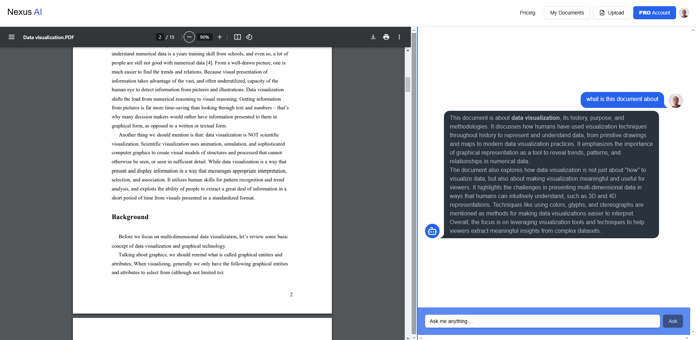

<h1 align="center">
   <br>
  Nexus AI
  <br>
</h1>

<h4 align="center">Store and Chat with Your Documents anywhere anytime</h4>
<br />
<p align="center">
<a href="https://www.producthunt.com/posts/nexus-ai-3?embed=true&utm_source=badge-featured&utm_medium=badge&utm_souce=badge-nexus&#0045;ai&#0045;3" target="_blank"></a>
</p>


<p align="center">
  <a href="#key-features">Key Features</a> •
<!--   <a href="#how-to-use">How To Use</a> • -->
  <a href="https://nexusai-pdf.vercel.app/" target="_blank">Live Link</a> •
  <a href="https://youtu.be/ABdXAWunyuc" target="_blank">Demo</a> •
  <a href="#disclaimer">Disclaimer</a> •
  <a href="#related">Related</a> • 
  <a href="#license">License</a>
</p>



## Key Features

**Chat with your Docs** - Get to interact with your documents using GPT-4o 
* **Secure** - Multi-factor Authentication and Secure Document Storage using Clerk and Firebase respectively. 
* **Pricing** - The Free / Pro plan is available to allow you access all features.
* **Real Time Subscription** - Paystack Integration, Pay for the Pro Plan using M-Pesa, Visa, Mastercard

## How To Use

To clone and run this web app, you'll need [Git](https://git-scm.com) and [Node.js](https://nodejs.org/en/download/) (which comes with [npm](http://npmjs.com)) installed on your computer. From your command line:

```bash
# Clone this repository
$ git clone https://github.com/preston176/nexusAI

# Go into the repository
$ cd nexusAI

# Install dependencies
$ npm install

# Run the app
$ npm run dev
# Open browser http://localhost:3000
```
### .env Configuration Guide

1. Create A `.env` file and add the following:


<details>
    <summary>Environment Variables</summary>

    ```bash
    # Clerk API Keys
    NEXT_PUBLIC_CLERK_PUBLISHABLE_KEY=pk_test_xxxxxxxxxx
    CLERK_SECRET_KEY=sk_test_xxxxxxxxxx
    # Pinecone API Key
    NEXT_PUBLIC_PINECONE_API_KEY=pcsk_xxxxxxxxxxxx

    # Gemini API Key
    NEXT_PUBLIC_GEMINI_API_KEY=AIzxxxxxxxxxxxx
    # OpenAI API Key
    OPENAI_API_KEY=sk-proj-xxxxxxxxxx

    # Paystack API Keys
    NEXT_PUBLIC_PAYSTECK_PUBLISHABLE_KEY=pk_test_xxxxxxxxxxxxx
    PAYSTACK_API_KEY=sk_test_xxxxxxxxxxxxxxx
    NEXT_PUBLIC_PAYSTACK_PUBLIC_KEY=pk_test_xxxxxxxxxxxxxxx
    PAYSTACK_WEBHOOK_SECRET=abc

    # Firebase
    FIREBASE_STORAGE_BUCKET=xxxxxx.firebasestorage.app
    FIREBASE_SERVICE_ACCOUNT_JSON=<base64 encoded json>
    you can do this by running cat service_key.json | base64 after downloading the service_key.json file and placing it in the root of the project

    # Azure OpenAI API Configuration
    AZURE_OPENAI_API_INSTANCE_NAME=nexusaxxxxx
    AZURE_OPENAI_API_KEY=5KdeOKxxxxxxx
    AZURE_OPENAI_API_VERSION=2024-02-01
    AZURE_OPENAI_API_EMBEDDINGS_DEPLOYMENT_NAME=text-embedding-ada-002

  
    ```
</details>


## Live Preview

- https://nexusai-pdf.vercel.app/


## Disclaimer

- Copyright Compliance: By using [NexusAI](https://nexusai-pdf.vercel.app/), you agree to comply with Clerk's terms of service and respect copyright laws. 


## Support

<a href='https://ko-fi.com/A0A1TVTET' target='_blank'></a>

## License

MIT

---

> [prestonmayieka.tech](https://www.prestonmayieka.tech) &nbsp;&middot;&nbsp;
> GitHub [@preston176](https://github.com/preston176) &nbsp;&middot;&nbsp;
> Twitter [@preston_mayieka](https://twitter.com/preston_mayieka)

