<!-- Nexus AI - Landing Section -->

<h1 align="center">🚀 Nexus AI</h1>
<p align="center"><em>Secure, Scalable Document Chat Powered by GPT-4o, Giini, and LangChain</em></p>

<p align="center">
  <a href="https://www.producthunt.com/posts/nexus-ai-3" target="_blank">
    
  </a>

<!-- GitHub Repository Badges -->

<p align="center">
  <a href="https://github.com/preston176/nexusAI" target="_blank">
    
  </a>

  <a href="https://github.com/preston176/nexusAI/issues" target="_blank">
    
  </a>
  <a href="https://github.com/preston176/nexusAI" target="_blank">
    
  </a>
</p>


<!-- Landing Page Preview Section -->

<h2 id="landing-page">🌐 Screenshot</h2>

<p align="center">
  <a href="https://nexusai-pdf.vercel.app" target="_blank">
    
  </a>
</p>

<div align="center">
  <a href="https://nexusai-pdf.vercel.app" target="_blank" style="margin-right: 12px;">
    🌐 <strong>Live App</strong>
  </a>
  |
  <a href="https://youtu.be/ABdXAWunyuc" target="_blank" style="margin-left: 12px;">
    🎥 <strong>Watch Demo</strong>
  </a>
</div>

<!-- Overview Section -->

<h2>📄 Overview</h2>

<div>
  <strong>Nexus AI</strong> is a full-stack web application that enables users to securely upload and interact with documents via conversational AI.
  <br><br>
  It combines:
  <ul>
    <li>🔐 Modern Authentication</li>
    <li>☁️ Cloud Storage</li>
    <li>🧠 Vector Indexing</li>
    <li>🤖 Multi-provider LLM orchestration via <strong>LangChain</strong></li>
  </ul>
  <br>
  <strong>Key Use Cases:</strong>
  <ul>
    <li>📑 Document Search</li>
    <li>✅ Compliance QA</li>
    <li>🧾 Personal Knowledge Base</li>
    <li>🔍 AI Research Assistant</li>
  </ul>
</div>

## Architecture

```mermaid
graph TD
  User[🧑 User] --> UI[🌐 Nexus AI App]
  UI --> Auth[🔐 Sign In<br>via Clerk]
  UI --> Upload[📄 Upload Document]
  Upload --> Store[☁️ Saved to Cloud<br>Firebase]
  Upload --> Understand[🤖 Analyze Content<br>with AI]
  Understand --> Ask[❓ Ask a Question]
  Ask --> Search[🔎 Find Relevant Info]
  Search --> Respond[Get response<br>from LLM]
  UI --> Pay[💳 Upgrade Plan<br>via Paystack]
```



---

## Features

- 🔐 **Multi-factor Authentication** with Clerk
- 📄 **PDF Storage** using Firebase Cloud Storage
- 🧠 **LLM Orchestration** via LangChain
- 🔎 **Vector Search** using Pinecone
- 💬 **Multi-LLM Support**: GPT-4o, Gemini, Azure, Groq
- 💳 **Subscription Billing** powered by Paystack
- 🐳 **Docker Compatible** with environment-driven config

---

## Technology Stack

| Layer         | Technology                             |
| ------------- | -------------------------------------- |
| Frontend      | Next.js, TailwindCSS                   |
| Auth          | Clerk.dev                              |
| File Storage  | Firebase Cloud Storage                 |
| Vector Search | Pinecone                               |
| LLM Runtime   | LangChain                              |
| LLM Providers | OpenAI, Gemini, Azure OpenAI, Groq     |
| Payments      | Paystack                               |
| Deployment    | Docker, Vercel                         |

---

## Setup

### Local Development

```bash
git clone https://github.com/preston176/nexusAI
cd nexusAI
npm install
npm run dev
```

App will be available at `http://localhost:3000`.

---

### Environment Variables

Create a `.env` file with the following:

```env
# Clerk Auth
NEXT_PUBLIC_CLERK_PUBLISHABLE_KEY=...
CLERK_SECRET_KEY=...

# Pinecone
NEXT_PUBLIC_PINECONE_API_KEY=...

# LLM APIs
NEXT_PUBLIC_GEMINI_API_KEY=...
OPENAI_API_KEY=...
GROQ_API_KEY=...

# Paystack
NEXT_PUBLIC_PAYSTECK_PUBLISHABLE_KEY=...
PAYSTACK_API_KEY=...
NEXT_PUBLIC_PAYSTACK_PUBLIC_KEY=...
PAYSTACK_WEBHOOK_SECRET=...

# Firebase
FIREBASE_STORAGE_BUCKET=nexusai-pdf.firebasestorage.app
FIREBASE_SERVICE_ACCOUNT_JSON=<base64 encoded service_key.json>

# reCAPTCHA / Forms
NEXT_PUBLIC_RECAPTCHA_SITE_KEY=...
NEXT_PUBLIC_FORMSPREE_API=...
```

### Optional: Azure OpenAI Integration

```env
AZURE_OPENAI_API_INSTANCE_NAME=...
AZURE_OPENAI_API_KEY=...
AZURE_OPENAI_API_VERSION="2024-02-01"
AZURE_OPENAI_API_EMBEDDINGS_DEPLOYMENT_NAME="text-embedding-ada-002"
```

---

## Docker Support

```bash
docker build -t nexusai-pdf .
docker run -p 3000:3000 --env-file .env nexusai-pdf
```

---

## License

MIT License

---

## Author

Built by [Preston Mayieka](https://preston176.vercel.app)  
GitHub: [@preston176](https://github.com/preston176)  
Twitter: [@preston_mayieka](https://twitter.com/preston_mayieka)
